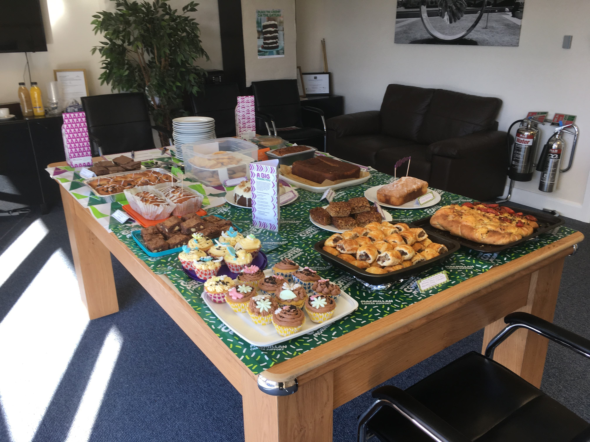
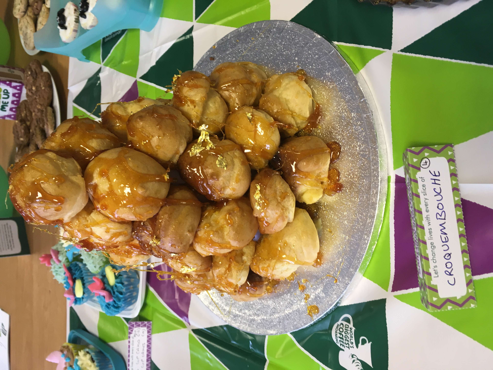
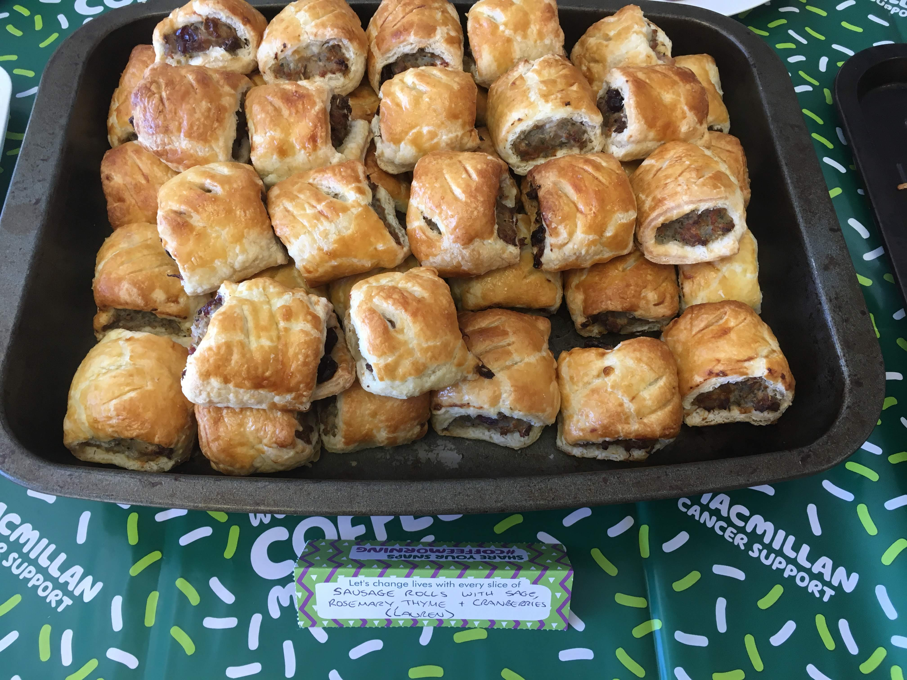

ACME Corporation hosted their first ever Macmillan Coffee Morning at their offices on the 27th September, and it was a great morning. 

Everyone in the office got their aprons on and baked some delicous treats. We had a whole table full of tasty food to eat.

One of the highlights of the bakes was the fantastic croquembouche that was made - it came with sparklers and everything! It won the "Best Bake" of the morning, with the winner receiving a wonderful new apron and Macmillan Coffee Morning mug. 

Another shout out was for the savoury dish of the day, some delicious sausage rolls made with sage, thyme, rosemary and cranberries.

Having this Coffee Morning was the perfect chance for everyone to catch up over a cuppa and a slice of something delicious for a great cause. One in two of us will face cancer, and the money we raised today will help everyone with cancer to live life as fully as they can. 

Thank you to everyone who baked and donated today - we managed to raise a whopping £250! 

If you would like to find out more about Macmillan Cancer Support, you can visit their website [here](https://www.macmillan.org.uk)